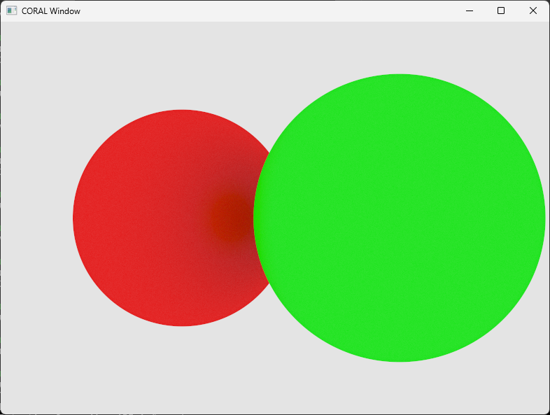

# CORAL

## Introduction
CORAL, a collection of rendering abstraction layers, aims to help you in managing scenes of objects, rendering and
displaying these scenes and interfacing with the user. Other tools, such as common data structures, support for
multithreading, vector and matrix types and more, are also available. These tools are organized into so-called
sub-modules. For more information about the capabilities of CORAL, see the documentation of each sub-module.

Even though CORAL aims to support multiple platforms, only Windows is currently supported. On other platforms, headless
builds will automatically be created; as a result, scenes can only be rendered into a framebuffer, whose contents can
then be saved into a file. Support for Linux and other platforms is planned, but will not arrive in the near future.


## Prerequisites
To build CORAL, CMake whith a minimum version of 3.24 and a compiler capable of compiling C17 and C++20 are required. If
tests are to be built, the testing framework [Unity][unity] will be downloaded and stored in a `dependencies` directory,
which will be created under the project's root directory; no other dependencies are used.


## Building and installing
Building and installing CORAL can be done in the usual way, starting in the project's root directory:
```sh
mkdir build && cmake -S . -B build
cmake --build build
cmake --install build
```


Additional build options are also available, for example:
- `CORAL_BUILD_TESTS`: If set to `ON`, tests will be build alongside the actual library. For more information about
    testing, see [Testing](#testing). (Default: `OFF`)

- `CORAL_USE_IPO`: If set to `ON`, will try to use IPO (interprocedural optimization), which could further optimize the
    code, even beyond translation unit boundaries. (Default: `ON`)

- `CORAL_USE_SANITIZATION`: If set to `ON`, will use address and UB sanitization. (Default: `OFF`)

- For more options, see the `CMakeLists.txt` file.


Once CORAL has been installed, it can be used from within CMake by, for example, using the `find_package()` function.
This package includes the `CORAL::CORAL` target, a dynamic library which implements all of the functionalities CORAL
provides and which can be linked to another target.

The header files of CORAL can be accessed through the `CORAL/` prefix, for example:
```c
#include "CORAL/containers/linkedList.h"
```


### Additional note for installing on Windows
Because CORAL is a dynamic library, the path of the executable directory of an installation is added to the current
user's `PATH` environment variable. If a complete uninstall is to be done, this path must be removed from the
environment variable. Additionally, administrator rights may be required if the default install destination is used,
which usually is `C:\Program Files (x86)\`.


## Usage
The following code snippet shows how CORAL can be used to render a scene into a window:
```c

#include <stddef.h>
#include <stdbool.h>
#include "CORAL/coral.h"

int main(void) {
    // Starts the graphics sub-module
    Graphics_startup();

    // A window that will be displayed to the user
    Window_t window;
    Window_init(&window, 800U, 600U, NULL);

    // Queries the width and height of part of the window that will be drawn into
    size_t windowWidth;
    size_t windowHeight;
    Window_getDrawableDimensions(&window, &windowWidth, &windowHeight);

    // A scene containing objects such as cameras or spheres
    Scene_t scene;
    Scene_init(&scene);

    // Sets the scene's background colour using Vec3b_u's r, g and b members
    scene.backgroundColour = ((Vec3b_u){.r = 200U, .g = 200U, .b = 200U});

    // Groups of components which can be added to objects to expand their behaviour or to store additional information
    // about them
    ComponentClass_t basicComponentClass;
    ComponentClass_t drawableComponentClass;

    // To be added to a Scene_t, an object must include a SceneComponent_t
    ComponentClassElement_t basicComponentClassElements[] = {{CORAL_GRAPHICS_COMPONENT_TYPE_SCENE}};

    // To be displayed, an object may have to include a RenderingComponent_ot (depending on the renderer)
    ComponentClassElement_t drawableComponentClassElements[] = {{CORAL_GRAPHICS_COMPONENT_TYPE_RENDERING}};

    ComponentClass_init(&basicComponentClass,
                        NULL,
                        basicComponentClassElements,
                        CORAL_ARRAY_LENGTH(basicComponentClassElements)
    );

    // drawableComponentClass "inherits" from basicComponentClass, which means that all objects adding components from
    // drawableComponentClass will also have components the components of basicComponentClass added to them
    ComponentClass_init(&drawableComponentClass,
                        &basicComponentClass,
                        drawableComponentClassElements,
                        CORAL_ARRAY_LENGTH(drawableComponentClassElements)
    );

    static const MaterialComponent_t redMaterial = {.diffuseColour = {.r = 255U, .g = 0U, .b = 0U, .a = 255U},
                                                    .specularColour = {.r = 255U, .g = 200U, .b = 200U},
                                                    .specularIntensity = 7U,
                                                    .roughness = 63U
    };

    static const MaterialComponent_t greenMaterial = {.diffuseColour = {.r = 0U, .g = 255U, .b = 0U, .a = 255U},
                                                      .specularColour = {.r = 200U, .g = 255U, .b = 200U},
                                                      .specularIntensity = 7U,
                                                      .roughness = 63U
    };

    SphereObject_t* sphereObjects[2U];          // Spheres which will be rendered
    PerspectiveCameraObject_t* cameraObject;    // Camera from whose perspective will be rendered

    for (size_t i = 0U; i < 2U; i++) {
        // Creates a static sphere; a pointer to the BaseObject_t member of that sphere is returned
        BaseObject_t* sphereBase = Object_init(CORAL_GRAPHICS_OBJECT_TYPE_SPHERE,
                                               &drawableComponentClass,
                                               CORAL_GRAPHICS_OBJECT_USER_FLAG_STATIC
        );

        // Casts the pointer to the BaseObject_t member of the sphere to the pointer to the actual SphereObject_t
        sphereObjects[i] = CORAL_TO_PARENT_PTR(SphereObject_t,
                                               base3D.base,
                                               sphereBase
        );

        sphereObjects[i]->radius = 2.5;

        // Sets the position of the sphere through Vec3_t's x, y, and z members
        sphereObjects[i]->base3D.position = ((Vec3_t){.x = (-0.5 + (Float_t)i) * 5.5, .y = 0.0, .z = 0.0});

        // Sets the rotation of the sphere through Vec3_t's pitch, yaw and roll members
        sphereObjects[i]->base3D.rotation = ((Vec3_t){.pitch = 0.0, .yaw = 0.0, .roll = 0.0});

        // Sets the scale of the sphere through Vec3_t's raw member, an array of values
        sphereObjects[i]->base3D.scale = ((Vec3_t){.raw = {1.0, 1.0, 1.0}});

        const MaterialComponent_t* sphereMaterial = (i) ? (&greenMaterial) : (&redMaterial);
        CORAL_ASSERT(Object_setActiveMaterial(&sphereObjects[i]->base3D.base, sphereMaterial),
                     "Failed to set a sphere's active material."
        );

        // Adds the sphere to the scene; its attributes (position, rotation, etc.) cannot be changed anymore
        Scene_addObject(&scene, &sphereObjects[i]->base3D, NULL);
    }

    // Creates a static camera and directly casts the returned pointer
    cameraObject = CORAL_TO_PARENT_PTR(PerspectiveCameraObject_t,
                                       base3D.base,
                                       Object_init(CORAL_GRAPHICS_OBJECT_TYPE_PERSPECTIVE_CAMERA,
                                                   &basicComponentClass,
                                                   CORAL_GRAPHICS_OBJECT_USER_FLAG_STATIC
                                       )
    );

    // Sets the camera's attributes
    cameraObject->base3D.position = ((Vec3_t){{10.0, 0.0, 10.0}});
    cameraObject->base3D.rotation = ((Vec3_t){{0.0, 45.0, 0.0}});
    cameraObject->base3D.scale = ((Vec3_t){1.0, 1.0, 1.0});
    cameraObject->aspectRatio = (Float_t)windowWidth / (Float_t)windowHeight;
    cameraObject->horizontalFOV = 40.0;
    cameraObject->distanceToNearPlane = 0.1;
    cameraObject->distanceToFarPlane = 1000.0;

    // Adds the camera to the scene; its attributes can also not be changed anymore
    Scene_addObject(&scene, &cameraObject->base3D, NULL);

    // Event loop, will only stop once the user closes the window or otherwise shuts down the process
    while (!(window.shouldClose || Window_allShouldClose())) {
        // Processes events send by the operating system
        Window_processEvents();

        // Draws the scene and waits for vertical sync
        Rendering_drawSceneToWindow(&window, &scene, &cameraObject->base3D, true);
    }

    // Destructs all previously created objects
    Scene_destr(&scene);
    Object_destr(&cameraObject->base3D.base);
    Object_destr(&sphereObjects[0U]->base3D.base);
    Object_destr(&sphereObjects[1U]->base3D.base);
    Window_destr(&window);

    // Shuts the graphics sub-module down
    Graphics_shutdown();
}
```


This results in the following, fairly uninteresting image if run on Windows using the RT_CPU (CPU-Pathtracer) renderer:




<a name="testing">

## Testing
For testing, the unit testing framework [Unity][unity] and the test driver ctest, which is include in CMake, is used. If
the tests have been build, they can be invoked in the following manner, starting in the project's root directory:
```sh
ctest --test-dir build
```


[unity]: https://github.com/ThrowTheSwitch/Unity.git
